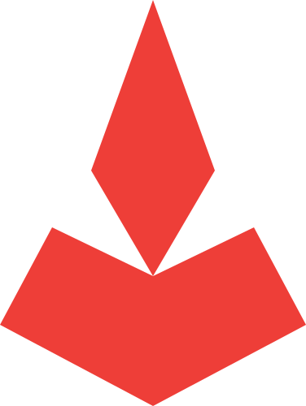

<p align="center">
  
</p>

<h1 align="center">Hephaestus for Obsidian</h1>

<p align="center"><em>Chat with your AI in Obsidian.</em></p>

<p align="center">
  <strong>0.8.0 — BETA.</strong> Usable daily, but the interface and the
  stored data format may still change between releases.
</p>

Hephaestus, stripped down to run as an [Obsidian](https://obsidian.md)
plugin: a chat pane inside your vault, talking directly to a local model
server. No backend process, no Electron shell of its own — the plugin
runs entirely inside Obsidian.

## Features

- **Chat with local models**, with live token streaming and Obsidian's
  own Markdown rendering (code blocks, tables, callouts for free).
- **Two backends.** Ollama (`/api/chat`) and any OpenAI-compatible
  server — LM Studio, llama.cpp, vLLM, LocalAI, Jan — selected in
  settings. Both streaming and non-streaming paths are supported.
- **Attachments.** Images (to vision models) and text files, from your
  computer or picked out of the vault.
- **Web search.** Pluggable backend: DuckDuckGo (no setup), a
  self-hosted SearXNG instance, or the Brave Search API. Top pages are
  read and sources cited inline.
- **Attach a web page.** Paste a URL and its text is pulled in as
  context — no search engine involved.
- **Thinking mode** on models that support it (Ollama only).
- **Note integration.** Optionally send the open note as context, insert
  a reply at the cursor, or let the model append to the note itself —
  behind a confirmation prompt.
- **Editable transcript.** Edit any message, regenerate the last reply,
  or delete a message and its answer.
- **Context gauge.** A ring in the composer showing how full the context
  window is: green under 50%, yellow under 75%, red above.

## What survives from Hephaestus, and what doesn't

| Hephaestus component            | Here                                    |
| ------------------------------- | --------------------------------------- |
| Electron + React shell          | **Dropped** — Obsidian is the host      |
| Python FastAPI backend          | **Dropped** — the plugin calls the model server directly from TypeScript |
| Ollama chat w/ streaming        | **Ported** |
| Conversation history (SQLite)   | **Ported** — plugin data (JSON), with images as files alongside it |
| Model picker                    | **Ported** — fed from `/api/tags` or `/v1/models` |
| Markdown rendering              | **Ported** — Obsidian's own renderer |
| Accounts / login / encryption   | **Dropped** — Obsidian is single-user   |
| Web search                      | **Ported** |
| Thinking mode                   | **Ported** — Ollama only; no OpenAI-compatible equivalent |
| Image input                     | **Ported** — attachments to vision models |
| Code agent / working directory  | **Not yet** — a vault-scoped agent is the natural sequel |
| Image generation                | **Dropped**                             |

## Dev setup

```bash
npm install
npm run build      # type-checks and bundles to main.js
npm test           # runs the unit tests
npm run dev        # rebuild on save
```

Then copy (or symlink) this folder into your vault at
`<vault>/.obsidian/plugins/hephaestus/` and enable it in
Settings → Community plugins.

## Choosing a server

Settings → Hephaestus → **Server**:

- **Ollama** — `http://localhost:11434`, the default.
- **LM Studio** — `http://localhost:1234`. Start the server from LM
  Studio's Developer tab. Enter the base URL *without* `/v1`.
The **Test** button checks reachability and lists the models it finds.
Switching servers restores that server's default URL and clears the
remembered model, since names differ between them.

A third option — a hosted "Cloud API key" provider — is built but not
exposed; see [CLAUDE.md](CLAUDE.md).

### Remote servers

Neither Ollama nor LM Studio has authentication, so never expose one
directly to the internet. Use Tailscale/WireGuard (simplest — nothing in
the plugin changes) or an SSH tunnel. A reverse proxy with bearer-token
auth will not work yet: the plugin has no setting for an
`Authorization` header.

## CORS and streaming

Obsidian pages run from the `app://obsidian.md` origin, and model
servers only accept browser requests from origins they trust. For
streaming to work:

```
OLLAMA_ORIGINS=app://obsidian.md ollama serve
```

For LM Studio, enable CORS in the Developer tab. Without this the plugin
falls back to Obsidian's `requestUrl`, which bypasses CORS but cannot
stream — you get the full reply at once instead of token by token. It
still works; it just stops feeling live.

## Platforms

Windows, macOS, and Linux. The plugin is desktop-only (`isDesktopOnly`)
because it uses Node APIs for hardware detection — that excludes
Obsidian mobile, not any desktop OS.

GPU detection differs by platform, and everything degrades to "VRAM
unknown" rather than failing:

| Platform | GPU name | VRAM |
| --- | --- | --- |
| Windows | `nvidia-smi`, else WebGL renderer | NVIDIA only |
| Linux | `nvidia-smi`, `lspci`, else WebGL | NVIDIA, plus AMD via sysfs |
| macOS (Apple silicon) | `system_profiler` | Unified — shares system RAM |
| macOS (Intel) | `system_profiler` | Discrete card VRAM |

On Apple silicon the GPU addresses system memory, so the fit check
compares against ~75% of total RAM instead of looking for dedicated
VRAM — a 30B model genuinely does fit on a 64 GB Mac, and reporting
"no GPU detected" there would be wrong rather than merely unhelpful.

## Context window

The context length is read from the model itself — Ollama reports it via
`/api/show`, LM Studio via its native API — and refreshed whenever you
switch models. Turn off **Detect context window automatically** to set
the number by hand. Detected values are capped at 131,072 tokens: some
models advertise far more than the machine can actually serve, and a
gauge scaled to a million tokens would read 0% forever.

That number drives two things: the gauge in the composer, and trimming.
When a request would overflow, the oldest messages are dropped and a
notice says how many — a model that has quietly forgotten the start of a
thread just looks like it got worse, so this is deliberately loud.

Token counts are estimated at ~4 characters per token, and images are
counted at a flat 800. Both are approximations meant to drive a gauge,
not to match your model's tokenizer exactly.

## Note writing and prompt injection

The model can call `write_to_note` to append to your open note. Untrusted
text reaches the model through web search results and attached files,
and either can contain instructions aimed at it. Every write therefore
shows a confirmation with the exact text first. The toggle in settings
can turn that off; leave it on.

## Layout

```
assets/              Logo, inlined into the bundle at build time
manifest.json        Obsidian plugin manifest
src/main.ts          Plugin, chat view, settings tab, API clients
src/lib.ts           Pure helpers (tokens, protocol translation) — tested
tests/               node --test suites over src/lib.ts
styles.css           Chat styling on Obsidian CSS variables
esbuild.config.mjs   Bundler config
esbuild.lib.mjs      Builds src/lib.ts for the tests
```

## Acknowledgements

Hephaestus is Apache-2.0 licensed (see [LICENSE](LICENSE)). It stands on
the following work:

| Project | Used for | License |
| --- | --- | --- |
| [Obsidian API](https://github.com/obsidianmd/obsidian-api) | Plugin, view, modal, and settings APIs the whole plugin is built on | MIT |
| [obsidian-sample-plugin](https://github.com/obsidianmd/obsidian-sample-plugin) | `esbuild.config.mjs` is adapted from its build configuration | 0BSD |
| [Lucide](https://github.com/lucide-icons/lucide) | Every icon in the UI, referenced by name through Obsidian's `setIcon` | ISC |
| [Ollama](https://github.com/ollama/ollama) | The `/api/chat` and `/api/tags` protocol this plugin speaks | MIT |
| [llmfit](https://github.com/AlexsJones/llmfit) | Inspiration for the System panel — hardware detection and model fit scoring | MIT |
| [esbuild](https://github.com/evanw/esbuild) | Bundling | MIT |
| [TypeScript](https://github.com/microsoft/TypeScript) | Type checking | Apache-2.0 |
| [builtin-modules](https://github.com/sindresorhus/builtin-modules) | Marking Node builtins external in the bundle | MIT |

Notes on what is and is not borrowed:

- **No code** is copied from llmfit. The System panel was inspired by it
  after reading its description; the fit heuristic here is far simpler
  (weights + 20% overhead vs VRAM then RAM), whereas llmfit models
  quantization, MoE architecture, and memory-bandwidth speed estimates.
  If you want serious model recommendations, use llmfit itself.
- **The OpenAI-compatible client** implements the publicly documented
  chat-completions request/response shape. No OpenAI code is included,
  and the plugin never contacts OpenAI — the shape is simply what LM
  Studio, llama.cpp, vLLM, and others expose.
- **Web search** scrapes `html.duckduckgo.com`. That is a service, not a
  dependency: no DuckDuckGo code is bundled, and use is subject to their
  terms.
- **Lucide** ships inside Obsidian; this plugin references icon names
  rather than bundling the icon set.
